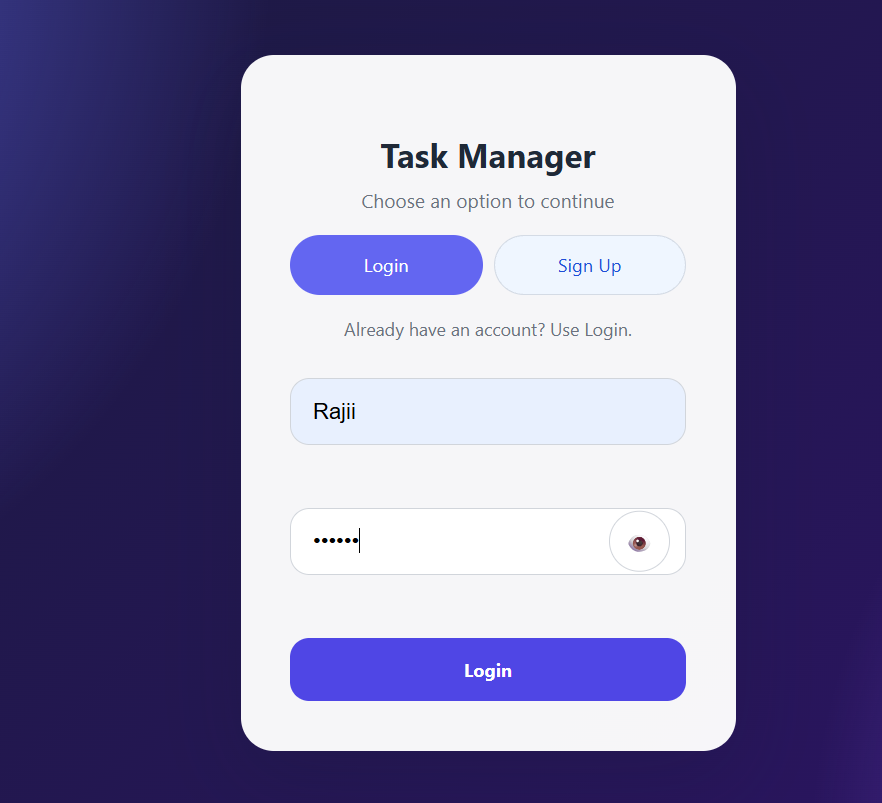
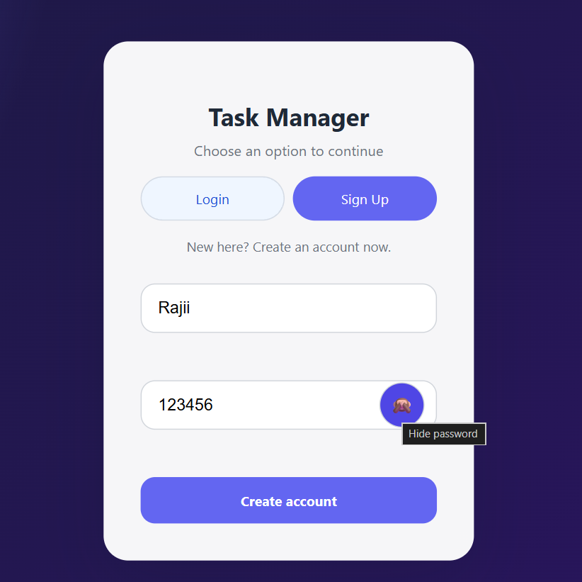
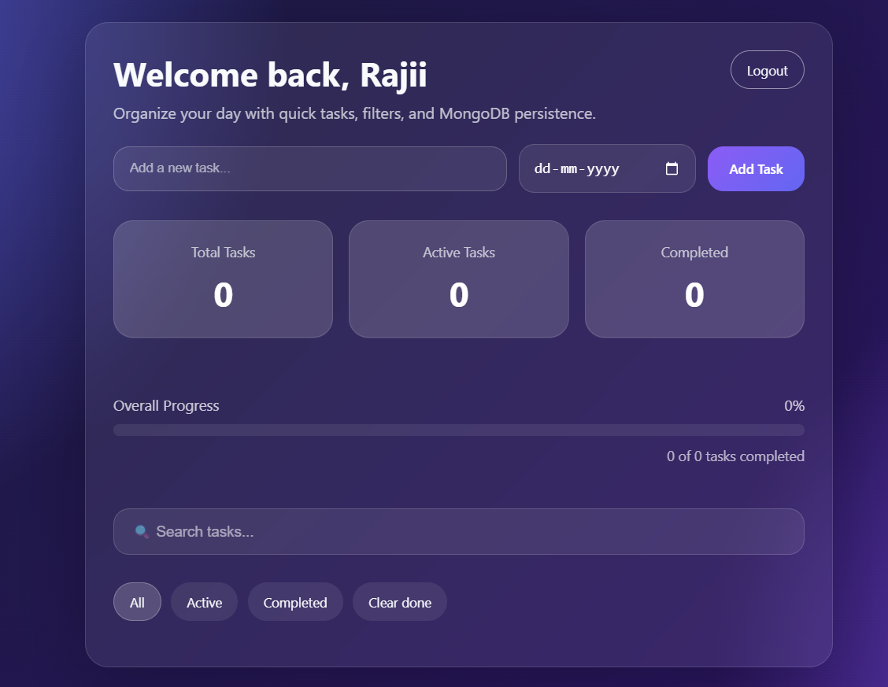
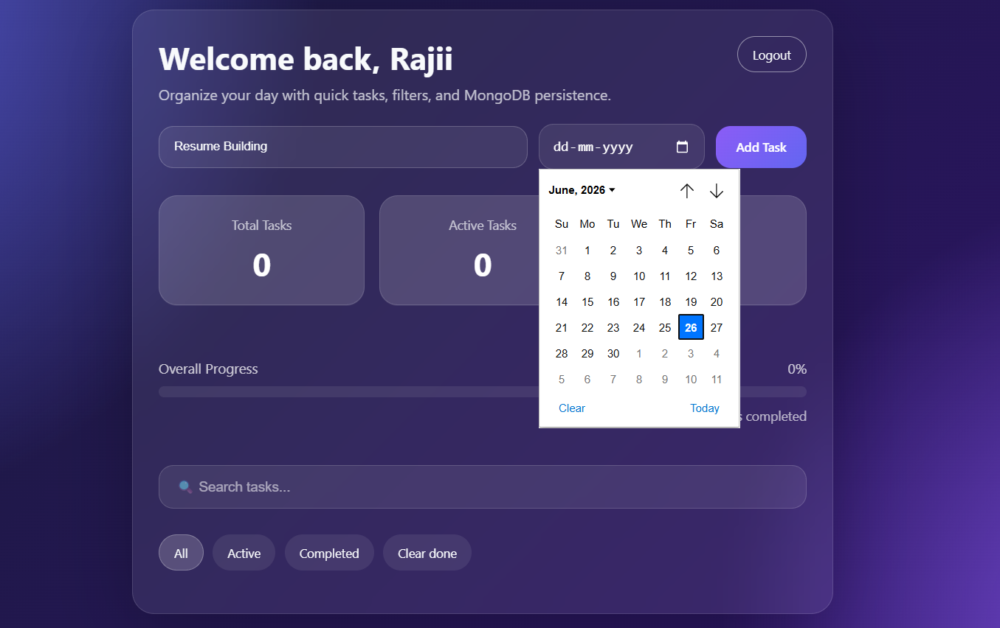
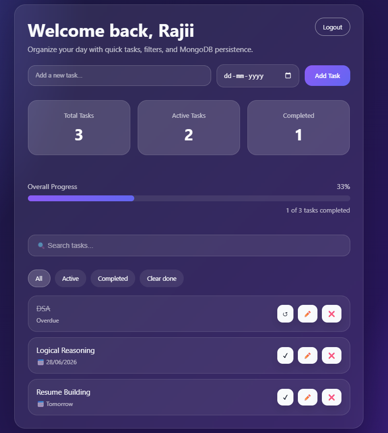
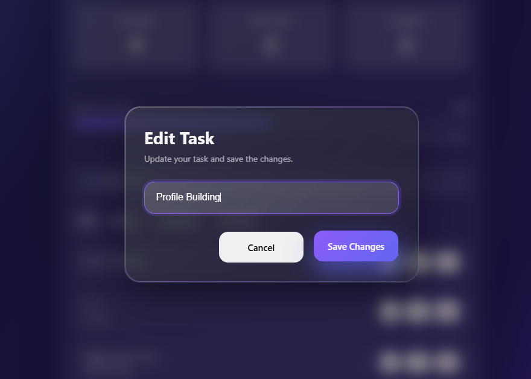

# 📋 Task Manager

<p align="center">


</p>

---

## 📖 Overview

Task Manager is a modern full-stack web application that helps users efficiently organize and manage their daily tasks.

Built using **Node.js**, **Express.js**, **MongoDB**, and **Vanilla JavaScript**, the application provides secure authentication using JWT, real-time task management, due date tracking, progress monitoring, filtering, search functionality, and a clean glassmorphism-inspired interface.

The application is designed with a responsive and intuitive user experience while following a clean backend architecture.

---

# ✨ Features

### 🔐 Authentication

- User Registration
- User Login
- JWT Authentication
- Protected Dashboard
- Secure Logout

---

### ✅ Task Management

- Create Tasks
- Edit Tasks
- Delete Tasks
- Mark Tasks Complete
- Mark Tasks Active
- Clear Completed Tasks

---

### 📅 Due Date Support

- Assign Due Dates
- Overdue Task Indicator
- Tomorrow Indicator
- Date Display

---

### 📊 Dashboard Analytics

- Total Tasks
- Active Tasks
- Completed Tasks
- Live Progress Bar
- Completion Percentage

---

### 🔎 Productivity

- Search Tasks
- Filter Tasks
  - All
  - Active
  - Completed

---

### 🎨 User Interface

- Modern Glassmorphism Design
- Responsive Layout
- Animated Progress Bar
- Toast Notifications
- Custom Edit Modal
- Smooth User Experience

---

# 📷 Screenshots

## Login



---

## Registration



---

## Dashboard



---

## Due Date Selection



---

## Progress Tracking



---

## Edit Task



---

# 🛠 Tech Stack

## Frontend

- HTML5
- CSS3
- JavaScript

## Backend

- Node.js
- Express.js

## Database

- MongoDB
- Mongoose

## Authentication

- JWT
- bcryptjs

---

# 📂 Project Structure

```text
Task-manager
│
├── backend
│   ├── middleware
│   ├── models
│   ├── routes
│   ├── server.js
│   ├── package.json
│   └── .env
│
├── public
│   ├── css
│   ├── js
│   ├── dashboard.html
│   ├── index.html
│   └── about.html
│
├── screenshots
│
├── .gitignore
└── README.md
```

---

# ⚙ Installation

## Clone Repository

```bash
git clone https://github.com/Suchendra-018/Task-manager.git
```

---

## Enter Project

```bash
cd Task-manager
```

---

## Install Dependencies

```bash
cd backend

npm install
```

---

## Configure Environment Variables

Create a `.env` file inside the backend folder.

```env
MONGO_URI=your_mongodb_connection_string

JWT_SECRET=your_secret_key

PORT=3000
```

---

## Start the Server

```bash
npm start
```

or

```bash
npm run dev
```

---

Open

```
http://localhost:3000
```

---

# 📡 API Endpoints

## Authentication

| Method | Endpoint | Description |
|---------|----------|-------------|
| POST | /api/register | Register User |
| POST | /api/login | Login User |

---

## Tasks

| Method | Endpoint | Description |
|---------|----------|-------------|
| GET | /api/tasks | Get All Tasks |
| POST | /api/tasks | Create Task |
| PUT | /api/tasks/:id | Update Task |
| DELETE | /api/tasks/:id | Delete Task |
| POST | /api/tasks/clear-completed | Remove Completed Tasks |

---

# 🔒 Authentication

The application uses **JWT (JSON Web Tokens)** for secure authentication.

Each authenticated request includes the JWT token in the Authorization header to ensure protected access to task operations.

---

# 🚀 Future Improvements

- Task Categories
- Drag and Drop Tasks
- Calendar View
- Email Reminders
- Dark / Light Theme Toggle
- Mobile Application

---

# 👨‍💻 Author

**Suchendra A**

Information Science Engineering Student

Cambridge Institute of Technology, Bengaluru


---

# ⭐ Support

If you found this project useful, consider giving it a ⭐ on GitHub.
It helps support the project and motivates future development.